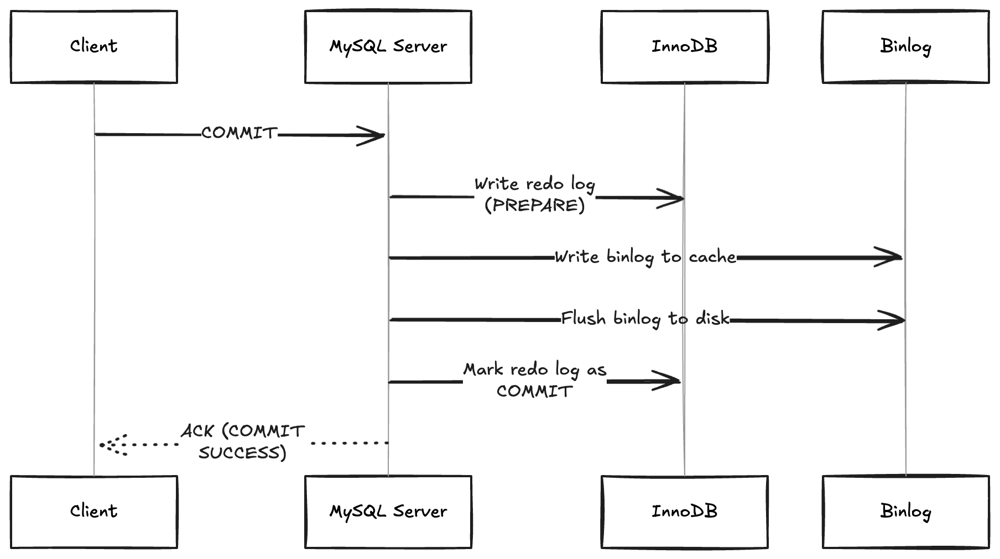
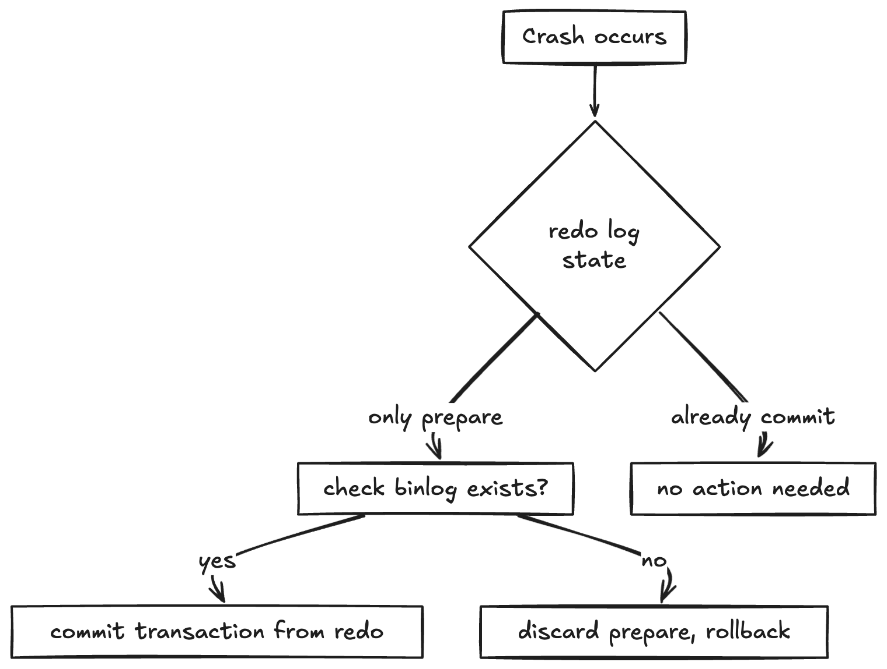

# MySQL 两阶段提交（2PC）详解：原理、流程与示例

[[toc]]

在生产环境中，MySQL 经常用于业务的主从复制、灾备与审计分析。但你是否思考过：当执行一次事务提交（COMMIT）时，MySQL 是如何保证这笔数据不仅写入数据库，还写入 binlog，并且在崩溃后能一致恢复？

这背后的核心机制是 —— **两阶段提交（Two-Phase Commit，2PC）**。本文将深入探讨 MySQL 的两阶段提交原理、流程以及示例。

## 为什么需要两阶段提交？
在 MySQL 中，事务日志涉及两个重要的系统：
| 日志类型         | 说明                            |
| ------------ | ----------------------------- |
| **redo log** | InnoDB 的物理日志，用于崩溃恢复           |
| **binlog**   | MySQL Server 层的逻辑日志，用于主从复制、审计 |


问题在于：**这两套日志系统是独立的**，但又必须同步一致。

**可能出现的问题**
- **场景 1：** redo log 写入成功，binlog 写入失败 → 崩溃后主库有数据，从库却没有

- **场景 2：** binlog 写了，redo log 没有 commit → 事务内容写入 binlog，但数据库中并不存在这笔记录

为解决这些“不一致”的风险，MySQL 在 redo 与 binlog 之间引入了 **两阶段提交协议（2PC）**。

## MySQL 两阶段提交原理流程
当一个事务执行 COMMIT 时，后台实际执行了如下流程：


### 步骤说明：
prepare 阶段：InnoDB 写入 redo log，标记为 prepare 状态

binlog 写入：Server 层将 binlog 写入缓存并刷盘

commit 阶段：InnoDB 将 redo log 标记为 commit

全部成功后，才向客户端返回 COMMIT OK

## 崩溃恢复时如何保证一致性？
在数据库崩溃后，MySQL 会进行日志恢复，判断哪些事务该重做、哪些要放弃。判断逻辑如下


MySQL 会在恢复时检测：

如果 redo 是 prepare，但找不到对应 binlog，就不会重做（等价于事务失败）

如果两个都存在，就将事务恢复为“已提交”

## 实战 SQL 示例
- 示例 1：标准事务提交
```sql
START TRANSACTION;

INSERT INTO accounts (id, name, balance) VALUES (101, 'Alice', 1000);
UPDATE accounts SET balance = balance - 100 WHERE id = 101;

COMMIT;
```
后台流程中会先写 redo prepare，再写 binlog，最后 redo commit

- 示例 2：查看 binlog 内容验证
```sql
SHOW BINARY LOGS;
```
输出中能看到：
```sql
BEGIN
INSERT INTO accounts ...
UPDATE accounts ...
COMMIT
```
- 示例 3：模拟事务未完成即宕机（理论）
```sql
START TRANSACTION;
UPDATE accounts SET balance = balance + 100 WHERE id = 102;

-- 模拟 mysqld 异常退出，此时 redo 是 prepare，binlog 未写
```

## 如何配置才能保障两阶段提交生效
| 参数                               | 推荐值   | 说明                |
| -------------------------------- | ----- | ----------------- |
| `sync_binlog`                    | `1`   | 每次写事务都强制刷盘 binlog |
| `innodb_flush_log_at_trx_commit` | `1`   | 每次事务提交都刷 redo log |
| `binlog_format`                  | `ROW` | 使用 row 格式便于精确恢复   |

这些参数共同确保 binlog 和 redo 日志能可靠持久化，从而保障 2PC 的完整性

## 2PC 与 XA 事务的区别
| 特性        | MySQL 内部 2PC  | XA 两阶段提交     |
| --------- | ------------- | ------------ |
| 涉及资源      | redo + binlog | 多个数据库、消息系统   |
| 是否应用开发者可控 | 不可见（自动完成）     | 需要应用配合 XA 语句 |
| 是否可恢复     | 是（crash-safe） | 需要协调器恢复机制    |

MySQL 的 两阶段提交机制 是事务持久性与主从一致性的保障机制。它通过协调 InnoDB 的 redo log 和 Server 层的 binlog，确保：
- 任意一个事务，要么 完整提交（写 redo + binlog）

- 要么 完整失败（丢弃所有 prepare）

这是 MySQL 实现可靠复制、崩溃恢复的重要机制之一

## 参考链接
- [官方文档: MySQL crash-safe binlog](https://dev.mysql.com/doc/refman/8.0/en/replication-options-binary-log.html)