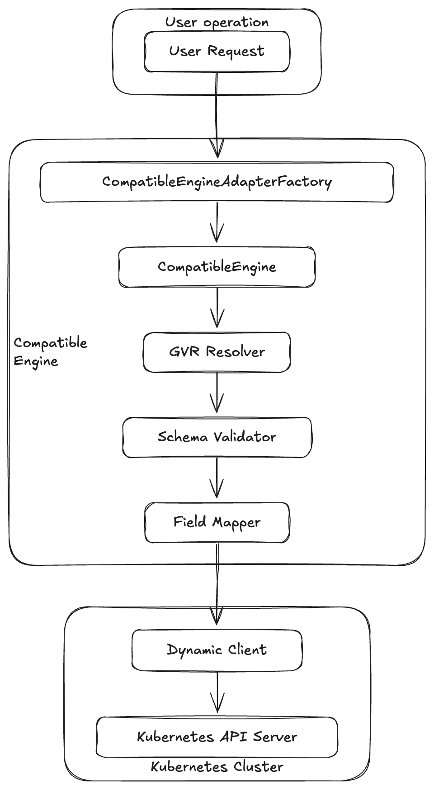

# Kubernetes Compatible Engine: 跨版本集群资源管理的利器

[[toc]]

在 Kubernetes 的实际应用中，企业常常需要同时管理多个不同版本的集群。​由于 Kubernetes API 在不同版本之间可能存在差异，这给资源的统一管理和部署带来了挑战。​为了解决这一问题，开源项目 [Kubernetes Compatible Engine](https://github.com/gagraler/kubernetes-compatible-engine) 应运而生，旨在提供一个统一的接口，简化多版本集群中资源的操作和管理。​

## 项目背景
Kubernetes 的 API 在不同版本之间可能存在差异，例如某个资源在一个版本中使用 apps/v1，而在另一个版本中可能使用 extensions/v1beta1。​这种差异可能导致部署失败或资源管理混乱。​Kubernetes Compatible Engine 通过自动发现和适配 GroupVersionResource（GVR），解决了这一兼容性问题。​

## 核心架构与组件
### CompatibleEngine
1. CompatibleEngine 数据结构
CompatibleEngine 是项目的核心数据结构，封装了 Kubernetes 资源的通用字段，如 Name、Kind、Labels、Replicas 和 Image 等。​通过统一的数据结构，开发者可以以一致的方式操作不同版本的 Kubernetes 资源，简化了资源管理的复杂性。​

2. GVR 自动发现与映射
项目通过 `adapter.NewCompatibleEngineAdapterFactory` 方法，结合 `discovery.DiscoveryInterface` 和 `dynamic.Interface`，实现了资源的 GVR 自动发现与映射。​这意味着开发者无需手动指定资源的 Group、Version 和 Resource，**系统会根据资源的 Kind 自动匹配最合适的 GVR**。​

3. 字段结构差异自动转换
不同版本的 Kubernetes 资源在字段结构上可能存在差异。​项目内置了字段结构差异自动转换机制，能够根据目标集群的版本，自动调整资源的字段结构，确保资源定义的兼容性。​

4. .spec 字段自动校验
为了提升资源配置的正确性，项目基于 OpenAPI Schema 实现了 .spec 字段的自动校验功能。​在资源创建或更新前，系统会自动验证资源的规范，避免因配置错误导致的部署失败。​

5. YAML / JSON 导入导出
项目支持资源的 YAML 和 JSON 格式的导入与导出，方便配置管理和版本控制。​开发者可以轻松地将资源定义导出为 YAML 或 JSON 文件，或从这些文件中导入资源定义。​

6. Controller 元数据导出
项目支持导出资源的 .metadata 字段，如 annotations、ownerReferences 等，便于集成和追踪。​对于构建自定义控制器或进行资源审计非常有用。

### 架构实现

1. 用户请求：
用户通过 kubectl 或其他工具发送资源操作请求。​

2. CompatibleEngineAdapterFactory：
接收用户请求，初始化 Compatible Engine 实例，准备资源操作所需的上下文。​

3. CompatibleEngine：
封装了 Kubernetes 资源的通用字段，如 Name、Kind、Labels、Replicas 和 Image 等。​

4. GVR Resolver：
利用 Kubernetes 的 Discovery API 动态解析资源的 GroupVersionResource（GVR），确保在不同版本的集群中正确识别资源。​

5. Schema Validator：
基于 OpenAPI Schema 对资源定义进行验证，确保其符合目标集群的规范。​

5. Field Mapper：
处理不同 Kubernetes 版本之间资源字段的差异，进行必要的字段映射和转换。​

6. Dynamic Client：
使用 Kubernetes 的 Dynamic Client 与集群进行交互，执行资源的创建、更新、删除等操作。​

7. Kubernetes API Server：
接收来自 Dynamic Client 的请求，最终在集群中执行相应的资源操作。​

## 应用场景
Kubernetes Compatible Engine 适用于以下场景：​

- `多版本集群管理`：​在需要同时管理多个不同版本的 Kubernetes 集群时，确保资源操作的一致性。

- `CI/CD 流水线集成`：​在持续集成和部署流程中，自动适配不同版本的集群，减少人为配置错误。

- `自定义资源管理`：​简化 CRD 的注册和使用，提升开发效率。

- `跨版本迁移`：​在进行集群升级或迁移时，确保资源定义的兼容性，降低风险。​

## 项目地址
项目托管在 GitHub 上，欢迎访问和贡献：
​
👉[kubernetes-compatible-engine]( https://github.com/gagraler/kubernetes-compatible-engine)

## 小结
Kubernetes Compatible Engine 为多版本 Kubernetes 集群的资源管理提供了统一、简洁的解决方案，适用于需要跨版本操作资源的开发者和运维人员。​通过自动适配和统一接口，降低了多版本兼容性的复杂度，提升了系统的稳定性和可维护性。​
